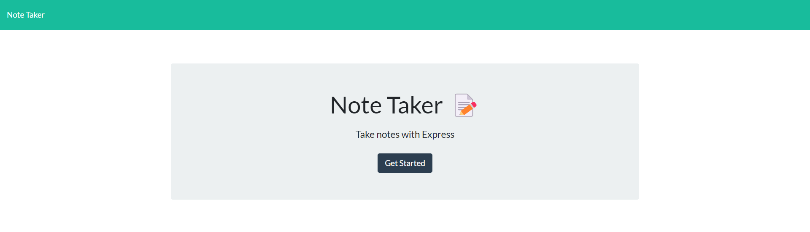
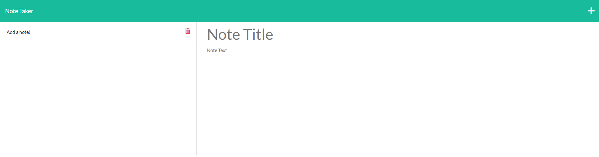
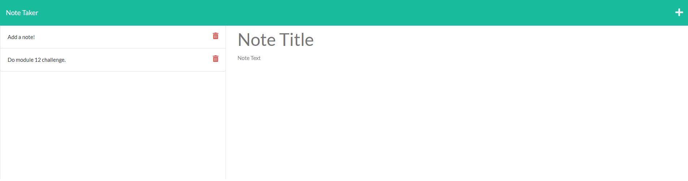

# Note Taker


  
## Description

An application called Note Taker that can be used to write and save notes. This application uses an Express.js back end and saves and retrieves note data from a JSON file. 







[Link to deployed application.](https://fathomless-peak-97593.herokuapp.com/)

## Table of Contents

- [Installation](#installation)
- [Usage](#usage)
- [License](#license)
- [Contributing](#contributing)
- [Tests](#tests)
- [Questions](#questions)

## Installation

Clone the code from this repository to your local machine. Node.js is required to run this application.
- Install express module.
- Install File System (fs) module.
- Install path module.
- Install UUID module.

## Usage

```
- navigate to deployed application
- click 'Get Started'
- enter a new note/title where prompted
- click the save button
- note is now saved to database
```

## License
    
Licensed under the [MIT License](https://spdx.org/licenses/MIT.html)

## Contributing

Contributions for this project not accepted at this time.

## Tests

No tests are currently scheduled for this project at this time.

## Questions

Have questions? Reach me at the following sources!

* GitHub: [realnifty](https://github.com/realnifty)
* E-mail: lovecore@pm.me
